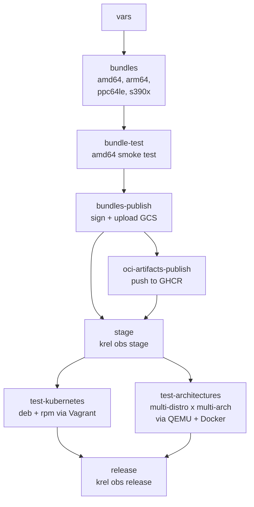
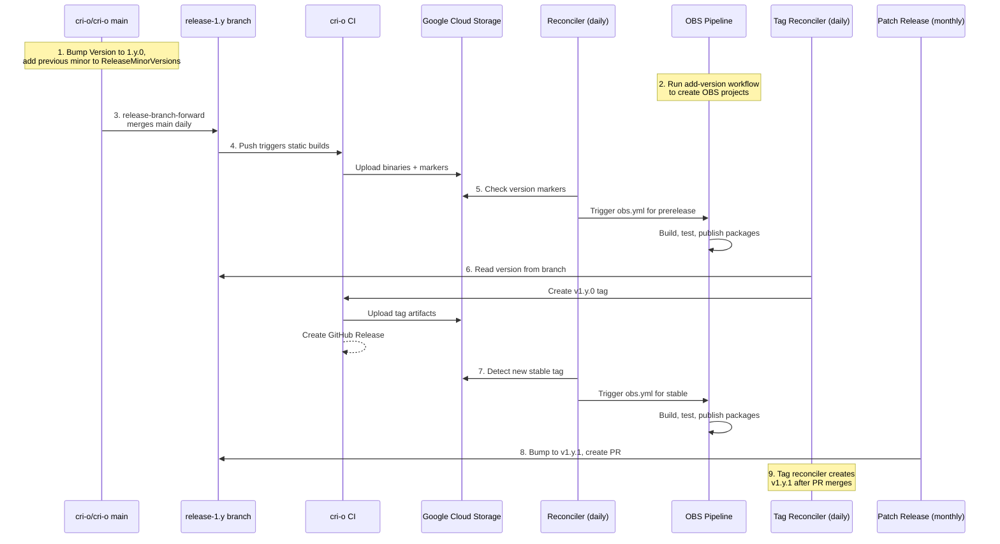

# CI Architecture

This document covers the packaging repository's CI/CD pipelines. For upstream
CRI-O CI (static builds, tag reconciler, patch releases, release branch forward,
GitHub releases), see the
[`cri-o/cri-o`](https://github.com/cri-o/cri-o) repository and its
[automated patch releases documentation](https://github.com/cri-o/cri-o/blob/main/scripts/automated-patch-releases.md).

<!-- toc -->

- [Upstream Interface](#upstream-interface)
- [OBS Workflow](#obs-workflow)
- [Reconciliation](#reconciliation)
- [Test Workflow](#test-workflow)
- [Add Version](#add-version)
- [Artifacts](#artifacts)
- [Signing and Verification](#signing-and-verification)
  - [What gets signed](#what-gets-signed)
  - [Verifying artifacts](#verifying-artifacts)
- [Version Resolution](#version-resolution)
- [Release Lifecycle](#release-lifecycle)
- [OBS Project Structure](#obs-project-structure)

<!-- /toc -->

## Upstream Interface

The packaging repository consumes artifacts produced by
[`cri-o/cri-o`](https://github.com/cri-o/cri-o) CI. The key integration points
are:

| Upstream artifact                 | Location                                                                                              | Used by                                                                        |
| --------------------------------- | ----------------------------------------------------------------------------------------------------- | ------------------------------------------------------------------------------ |
| Static binaries (`crio`, `pinns`) | `gs://cri-o/artifacts/<commit>/<arch>/`                                                               | [`scripts/bundle/build`](../scripts/bundle/build)                              |
| Version markers (`latest-*.txt`)  | `gs://cri-o/latest-*.txt`                                                                             | [`scripts/vars`](../scripts/vars), [`scripts/reconcile`](../scripts/reconcile) |
| OpenVEX report                    | `gs://cri-o/artifacts/<commit>/cri-o.openvex.json`                                                    | [`scripts/vex`](../scripts/vex)                                                |
| `ReleaseMinorVersions`            | [`internal/version/version.go`](https://github.com/cri-o/cri-o/blob/main/internal/version/version.go) | [`scripts/reconcile`](../scripts/reconcile)                                    |

## OBS Workflow

The
[`obs.yml`](https://github.com/cri-o/packaging/blob/main/.github/workflows/obs.yml)
workflow is the main packaging pipeline. It can be triggered manually
(`workflow_dispatch`) or by the reconciliation schedule. It accepts a `revision`
input (tag, branch name, or `main`) and optional skip flags for individual
stages.



**Jobs:**

| Job                     | Purpose                                                                                                                                                                                                                                                                                                                    |
| ----------------------- | -------------------------------------------------------------------------------------------------------------------------------------------------------------------------------------------------------------------------------------------------------------------------------------------------------------------------- |
| `vars`                  | Runs [`scripts/vars`](../scripts/vars) to resolve `COMMIT`, `VERSION`, `PROJECT`, and `PROJECT_TYPE` from the `REVISION` input. The workflow then calls [`scripts/github-job-wait`](../scripts/github-job-wait) to prevent duplicate builds for the same commit.                                                           |
| `bundles`               | Runs [`scripts/bundle/build`](../scripts/bundle/build) for each architecture. Downloads static binaries from GCS and runtime dependencies (conmon, runc, crun, CNI plugins, crictl, etc.) from their GitHub releases. Produces a tarball, SHA256 checksum, and SPDX SBOM per architecture.                                 |
| `bundle-test`           | Runs [`scripts/bundle/test`](../scripts/bundle/test) on the amd64 bundle: installs it, starts CRI-O, verifies the binary commit matches, and runs a test pod via crictl.                                                                                                                                                   |
| `bundles-publish`       | Runs [`scripts/vex`](../scripts/vex) (download VEX from GCS), [`scripts/provenance`](../scripts/provenance) (generate SLSA attestation via tejolote), and [`scripts/sign-artifacts`](../scripts/sign-artifacts) (cosign sign all artifacts). Uploads everything to GCS and writes a `latest-bundle-<revision>.txt` marker. |
| `oci-artifacts-publish` | Runs [`scripts/oci-artifacts`](../scripts/oci-artifacts) to push multi-architecture OCI image indexes to `ghcr.io/cri-o/bundle` with attached SBOMs, VEX, and provenance. All manifests and attachments are signed with cosign.                                                                                            |
| `stage`                 | Runs [`scripts/obs`](../scripts/obs) to stage the bundle and [spec file](../templates/latest/cri-o/cri-o.spec) into the OBS `build` project via `krel obs stage`.                                                                                                                                                          |
| `test-kubernetes`       | Runs [`scripts/test-kubernetes`](../scripts/test-kubernetes) for both deb and rpm: boots a Vagrant VM, installs packages from the OBS project, and validates a Kubernetes cluster.                                                                                                                                         |
| `test-architectures`    | Runs [`scripts/test-architectures`](../scripts/test-architectures) across a matrix of RPM and DEB based distributions and architectures (amd64, arm64, ppc64le, s390x) using QEMU emulation via Docker buildx.                                                                                                             |
| `release`               | Runs [`scripts/obs`](../scripts/obs) with `RUN_RELEASE=1` to promote packages from the `build` project to the top-level user-facing project. Only runs after all tests pass.                                                                                                                                               |

## Reconciliation

The
[`schedule.yml`](https://github.com/cri-o/packaging/blob/main/.github/workflows/schedule.yml)
workflow runs daily at 01:00 UTC. It executes
[`scripts/reconcile`](../scripts/reconcile), which:

1. Fetches `ReleaseMinorVersions` and `Version` from the CRI-O repository's
   `main` branch.
2. Lists all OBS prerelease `build` projects via `osc`. For each, it maps the
   project version to a CRI-O branch and triggers `obs.yml` if the project
   needs updating. It also cleans up old packages, keeping the 4 most recent.
3. Lists all OBS stable `build` projects. For each, it compares the packaged
   version against the latest tag from GCS (`latest-1.y.txt`). If they differ
   or the project is empty, it triggers `obs.yml` with the latest tag.

This is the mechanism that keeps packages up to date automatically, without
manual intervention after a tag is created or a release branch is updated.

## Test Workflow

The
[`test.yml`](https://github.com/cri-o/packaging/blob/main/.github/workflows/test.yml)
workflow runs on pushes to `main` and on pull requests. It validates code
quality: shell formatting (shfmt), linting (shellcheck), dependency checks
(zeitgeist), the [`get`](../get) install script (with and without signature
verification), markdown TOC (mdtoc), and formatting (prettier).

## Add Version

The
[`add-version.yml`](https://github.com/cri-o/packaging/blob/main/.github/workflows/add-version.yml)
workflow is triggered manually to bootstrap infrastructure for a new CRI-O minor
version. It runs [`scripts/add-version`](../scripts/add-version), which:

1. Infers the next version from the README (or accepts an explicit input).
2. Creates four OBS projects by copying metadata from the previous version:
   `stable:v1.y`, `stable:v1.y:build`, `prerelease:v1.y`,
   `prerelease:v1.y:build`.
3. Creates the `cri-o` package in both `build` projects.
4. Updates the README with new project entries and badges.
5. Opens a pull request with the changes.

## Artifacts

The following table lists all artifact types flowing through the CI system:

| Artifact                          | Format                     | Producer                          | Location                                            | Consumer                      |
| --------------------------------- | -------------------------- | --------------------------------- | --------------------------------------------------- | ----------------------------- |
| Static binaries (`crio`, `pinns`) | ELF, statically linked     | cri-o CI (Nix)                    | `gs://cri-o/artifacts/<commit>/<arch>/`             | Packaging `bundle/build`      |
| Version markers                   | Plain text                 | cri-o CI `upload-artifacts`       | `gs://cri-o/latest-*.txt`                           | Packaging `reconcile`, `vars` |
| OpenVEX report                    | JSON (OpenVEX)             | cri-o CI `govulncheck`            | `gs://cri-o/artifacts/<commit>/cri-o.openvex.json`  | Packaging `vex` script        |
| Binary bundles                    | tar.gz                     | Packaging `bundle/build`          | `gs://cri-o/artifacts/cri-o.<arch>.<id>.tar.gz`     | OBS, `get` script, users      |
| SBOM                              | SPDX JSON                  | Packaging `bundle/build`          | `cri-o.<arch>.<id>.tar.gz.spdx`                     | OCI registry, users           |
| Cosign signatures                 | `.sig`, `.cert`, `.bundle` | Packaging `sign-artifacts`        | Alongside each artifact in GCS                      | Users (verification)          |
| SLSA provenance                   | JSON (SLSA 1.0)            | Packaging `provenance` (tejolote) | `cri-o.<id>.provenance.json`                        | OCI registry, users           |
| OCI bundles                       | Multi-arch OCI image index | Packaging `oci-artifacts`         | `ghcr.io/cri-o/bundle:<tag>`                        | Users (ORAS, Podman)          |
| RPM/DEB packages                  | `.rpm`, `.deb`             | OBS builders                      | `download.opensuse.org/repositories/isv:/cri-o:/*/` | End users                     |
| Release notes                     | Markdown                   | cri-o CI `release-notes`          | GitHub Releases, `gh-pages` branch                  | Users                         |

The bundle tarball contains: `crio`, `pinns`, `conmon`, `conmon-rs`, `runc`,
`crun`, `crictl`, `crio-credential-provider`, CNI plugins, man pages, shell
completions, systemd unit files, and configuration files. Component versions are
pinned in
[`templates/latest/cri-o/bundle/versions`](../templates/latest/cri-o/bundle/versions).

## Signing and Verification

All artifacts are signed using [Sigstore](https://www.sigstore.dev/) keyless
signing. The `bundles-publish` job obtains an OIDC token from GitHub Actions,
which [Fulcio](https://github.com/sigstore/fulcio) uses to issue a short-lived
signing certificate. No long-lived signing keys are stored anywhere.

The certificate identity tied to all signatures is:

```text
Issuer:   https://token.actions.githubusercontent.com
Identity: https://github.com/cri-o/packaging/.github/workflows/obs.yml@refs/heads/main
```

### What gets signed

[`scripts/sign-artifacts`](../scripts/sign-artifacts) uses `cosign sign-blob` to
sign every artifact uploaded to GCS. For each file, three signature files are
produced:

| File                | Content                                                                     |
| ------------------- | --------------------------------------------------------------------------- |
| `<artifact>.sig`    | Detached signature                                                          |
| `<artifact>.cert`   | Signing certificate (from Fulcio)                                           |
| `<artifact>.bundle` | Complete Sigstore bundle (signature + certificate + transparency log entry) |

The following artifacts are signed:

- Binary bundle tarballs (`.tar.gz`, per architecture)
- SBOMs (`.tar.gz.spdx`, per architecture)
- OpenVEX report (`.openvex.json`, if available)
- SLSA provenance (`.provenance.json`, if available)

[`scripts/oci-artifacts`](../scripts/oci-artifacts) additionally signs all OCI
artifacts pushed to GHCR using `cosign sign`:

- Per-architecture OCI images
- The multi-architecture OCI image index
- Attached SBOMs, VEX reports, and provenance attestations

### Verifying artifacts

GCS blob artifacts can be verified with:

```bash
cosign verify-blob cri-o.amd64.v1.y.z.tar.gz \
    --certificate-identity https://github.com/cri-o/packaging/.github/workflows/obs.yml@refs/heads/main \
    --certificate-oidc-issuer https://token.actions.githubusercontent.com \
    --bundle cri-o.amd64.v1.y.z.tar.gz.bundle
```

OCI artifacts can be verified with:

```bash
cosign verify \
    --certificate-identity https://github.com/cri-o/packaging/.github/workflows/obs.yml@refs/heads/main \
    --certificate-oidc-issuer https://token.actions.githubusercontent.com \
    ghcr.io/cri-o/bundle:v1.y.z
```

The [`get`](../get) script automatically verifies signatures when `cosign` is
available in `$PATH`, and validates SBOMs when the `bom` tool is available.

## Version Resolution

The [`scripts/vars`](../scripts/vars) script translates a `REVISION` input into
the variables that all other scripts consume. The resolution depends on the
revision format:

| Input type     | Example       | `PROJECT_TYPE` | `COMMIT` source                   | `VERSION`                       |
| -------------- | ------------- | -------------- | --------------------------------- | ------------------------------- |
| Semver tag     | `v1.y.z`      | `stable`       | GitHub API                        | `1.y.z`                         |
| Release branch | `release-1.y` | `prerelease`   | `latest-release-1.y.txt` from GCS | `<latest>-dev`                  |
| `main`         | `main`        | `prerelease`   | `latest-main.txt` from GCS        | `<Version from version.go>-dev` |

The OBS project path is constructed as:
`isv:cri-o:<PROJECT_TYPE>:<PROJECT_VERSION>:build`

For example, a tag `v1.y.z` resolves to `isv:cri-o:stable:v1.y:build`, while
branch `release-1.y` resolves to `isv:cri-o:prerelease:v1.y:build`.

## Release Lifecycle

The following diagram shows how a new minor version flows through the system
from initial version bump to published packages:



Step by step:

1. **Version bump on `main`**: Set `Version` to `1.(y+1).0` and add `1.y` to
   `ReleaseMinorVersions`.
2. **Create OBS projects**: Run the `add-version` workflow to create the four
   OBS projects and update the packaging README with badges.
3. **Branch forward**: The `release-branch-forward` workflow merges `main` into
   `release-1.y` daily, as long as no tags exist on that branch.
4. **Binary uploads**: Every push to the release branch triggers static binary
   builds and GCS uploads in the CRI-O CI.
5. **Prerelease packaging**: The daily reconciler detects new commits and
   triggers `obs.yml`, producing prerelease RPM/DEB packages.
6. **Tagging**: The tag reconciler reads the version from the release branch
   and creates `v1.y.0` if it does not exist. This triggers the CRI-O test
   workflow, which creates a GitHub Release.
7. **Stable packaging**: The reconciler detects the new tag and triggers
   `obs.yml` for the stable OBS project.
8. **Patch releases**: Monthly, `patch-release.yml` bumps the patch version on
   each supported branch and creates PRs.
9. **Repeat**: After the patch PR merges, the tag reconciler creates the next
   patch tag and the cycle continues.

## OBS Project Structure

OBS uses a two-tier model for each version:

```text
isv:cri-o:stable:v1.y          <-- user-facing, published packages
  isv:cri-o:stable:v1.y:build  <-- staging, building, testing

isv:cri-o:prerelease:v1.y          <-- user-facing, published packages
  isv:cri-o:prerelease:v1.y:build  <-- staging, building, testing
```

The `build` subprojects are where `krel obs stage` pushes the bundle tarball and
RPM spec file. OBS builders then compile the packages for all configured
distributions and architectures. The `test-kubernetes` and
`test-architectures` jobs validate the resulting packages. Once all tests pass,
`krel obs release` promotes the packages from the `build` project to the
top-level project, making them available to end users via
`download.opensuse.org`.

The [`templates/latest/metadata.yaml`](../templates/latest/metadata.yaml) file
tells `krel` where to find the bundle in GCS:

```yaml
cri-o:
  - versionConstraint: ">= 1.28.0"
    sourceURLTemplate: "gs://cri-o/artifacts/cri-o.{{ .Architecture }}.v{{ .PackageVersion }}.tar.gz"
    sourceTarGz: true
```

For prerelease builds (branches, not tags), the [`scripts/obs`](../scripts/obs)
script patches this template to use the commit SHA instead of the version in the
GCS path.
